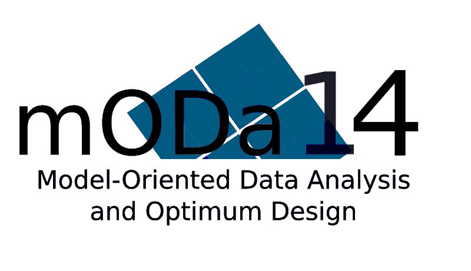
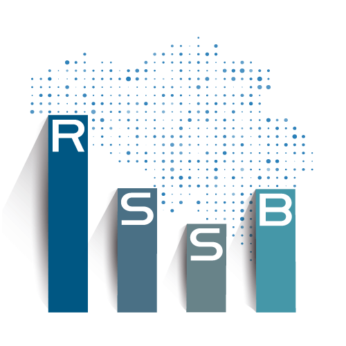
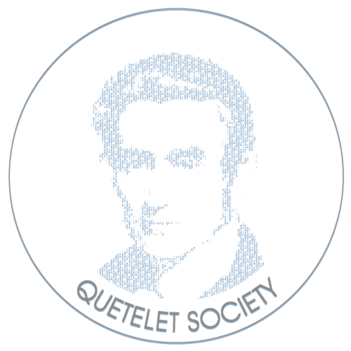

```{r setup, include=FALSE}
knitr::opts_chunk$set(echo = FALSE)

# Learn more about creating websites with Distill at:
# https://rstudio.github.io/distill/website.html

# Learn more about publishing to GitHub Pages at:
# https://rstudio.github.io/distill/publish_website.html#github-pages

```

```{r mODa-logo, out.width = "50%", fig.align = "center"}

```


The scientific workshops on model-oriented data analysis and optimum design (mODa) provide a high-level international forum for researchers, professionals and practitioners to present and discuss recent advances, new techniques and applications in the field of optimum experimental design. In addition, a primary aim is to provide young researchers an opportunity to establish personal contacts with leading specialists in the field. Its specificity is that the participation is by invitation of the board only. 

mODa14 will take place from June 14 till June 19 2026 in Drongen Abbey, Belgium


<br>


<center><b>Supported by</b></center>

<br>

<div style="text-align: center; margin: 1.5rem 0;">
  
</div>

<div style="text-align: center; margin: 1.5rem 0;">
  
</div>

<table style="margin: -2rem; border-collapse: collapse;">
  <tr>
    <td style="text-align: center; padding: 2.0rem;">
      
    </td>
    <td style="text-align: center; padding: 2.0rem;">
      
    </td>
  </tr>
  <tr>
    <td colspan="2" style="text-align: center; padding: 2.0rem;">
      
    </td>
  </tr>
</table>


<!--
<table style="margin: 0 auto; border-collapse: collapse;">
  <tr>
    <td style="margin-bottom:-10px;style="text-align: center; padding: 2.0rem;">
      
    </td>
    <td style="margin-bottom:-10px; style="text-align: center; padding: 2.0rem;">
      
    </td>
  </tr>
   </tr>
    </td>
    <td style="margin-bottom:-10px; style="text-align: center; padding: 2.0rem;">
      
-->

