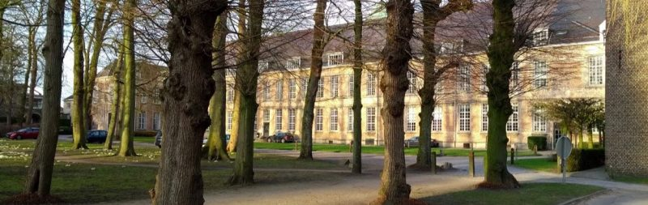
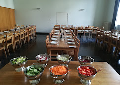
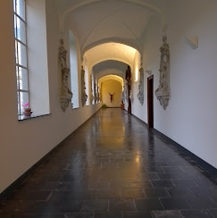
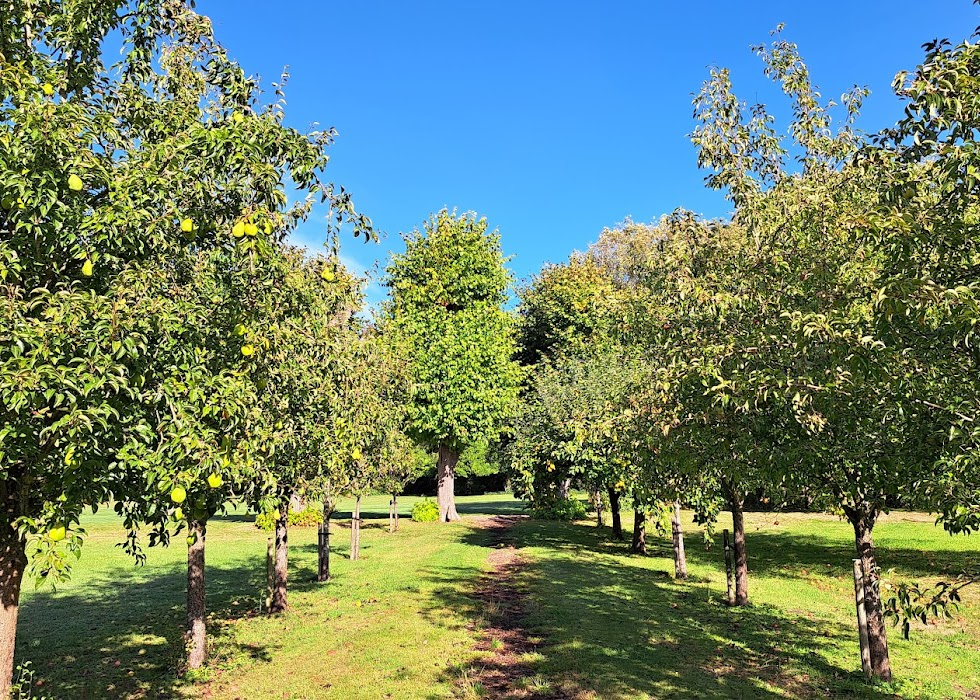

```{r setup, include=FALSE}
knitr::opts_chunk$set(echo = FALSE)
```

<center>The workshop is hosted by [KU Leuven](https://www.kuleuven.be/english/about-kuleuven) and takes place at [the Old Abbey in Drongen, Belgium](https://www.oudeabdij.be/english.html). Drongen Abbey is an established location for scientific conferences and has successfully hosted statistical meetings in the past, including in particular the Annual Meeting of the Royal Statistical Society (2024).

The location offers a main conference room with seating capacity of 110 participants, as well as opportunities to retreat for smaller working-group discussions. Drongen Abbey is easily accessible by public transportation from Gent (see travel), which is one of Belgium’s scientific and economic centres.
</center>

<br>


```{r soton-crest, out.width = "100%", fig.align = "center"}

```


<br>

The abbey dates back to 1138 and was founded by the Norbertines. It was severely damaged on several occasions, notably during the Iconoclastic Fury of 1566. Rebuilt between 1638 and 1698, the abbey acquired much of its present appearance during that period.

The French Revolution forced the community to leave in 1796, and the property was subsequently sold at public auction. For a time, the site was used as a cotton factory, until the abbey buildings were purchased by the Jesuit order in 1836 and converted into a novitiate.

Since 1968, the abbey has served as a retreat and conference centre. The buildings and the surrounding grounds have been listed as a protected monument since 1998.


<br>

<table style="margin: 0 auto; border-collapse: collapse;">
  <tr>
    <td style="text-align: center; padding: 1.0rem;">
      
    </td>
    <td style="text-align: center; padding: 1.0rem;">
      
    </td>
      <td style="text-align: center; padding: 1.0rem;">
      
    </td>
   </tr>
</table>


<div style="font-size:90%; text-align:left; max-width:700px; margin:auto;">
**House Rules of the Old Abbey:**

- **Respect the abbey’s atmosphere:** Please keep the corridors and common areas quiet so everyone can enjoy the serene and inspiring environment of the abbey.  
- **Quiet hours:** Kindly observe quiet hours from 10:00 PM onwards.  
- **Smoking policy:** For your health and everyone’s safety, smoking is not allowed inside the buildings or courtyards. A designated smoking area is available by the parking lot.  
- **Pets:** To ensure hygiene and comfort for all guests, pets are not permitted on the premises.  
- **Catering:** All drinks and meals are provided by the Oude Abdij and should be arranged via the abbey.

</div>


<!-- There has been an institution of higher education (the Hartley Institute) in Southampton [since 1862](https://www.southampton.ac.uk/about/reputation/history-timeline.page), with a University College at the main Highfield Campus since 1919. The University gained it's Royal Charter in 1952. S3RI was formed in 2003 to synergise the research of statisticians across the Mathematical, Social and Health Sciences, and Medicine. It will be celebrating its 20th anniversary when mODa14 is held. -->

<!-- The scientific sessions of mODa will be held in Building 100 (the Centenary Building), opened in 2019 to celebrate 100 years of higher education on the Highfield Campus. Accommodation will be in Chamberlain Halls.    -->

<!-- ```{r, fig.align = 'center'} -->
<!-- #| column: screen -->
<!-- library(leaflet) -->
<!-- leaflet() %>% -->
<!--   addTiles() %>% -->
<!--   setView( -->
<!--     lat= 50.93905529496468,   -->
<!--     lng= -1.3983952680035892, -->
<!--     zoom = 15) %>% -->
<!--   addMarkers( -->
<!--     lat= 50.9368557718911,   -->
<!--     lng= -1.3976215115885986, -->
<!--     label="Building 100 (Centenary Building)" -->
<!--   ) %>% -->
<!--   addMarkers( -->
<!--     lat = 50.94206924695994,  -->
<!--     lng = -1.402863385116312, -->
<!--     label = "Chamberlain Halls" -->
<!--   ) -->

<!-- ``` -->

<!-- <!-- -->
<!-- <iframe src="https://www.google.com/maps/embed?pb=!1m18!1m12!1m3!1d1495.2445619100063!2d-1.4020710093918929!3d50.9294258367944!2m3!1f0!2f0!3f0!3m2!1i1024!2i768!4f13.1!3m3!1m2!1s0x487474064491597b%3A0x7a832ae220279363!2sAvenue%20Campus!5e0!3m2!1sen!2suk!4v1660332969366!5m2!1sen!2suk" width="600" height="450" style="border:0;" allowfullscreen="" loading="lazy" referrerpolicy="no-referrer-when-downgrade"></iframe> -->
<!-- --> 
