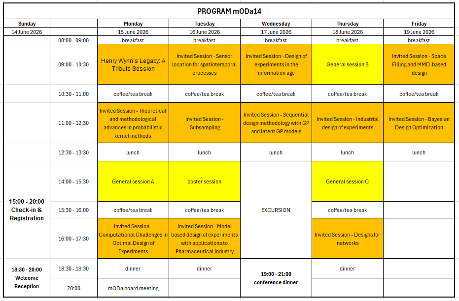

```{r setup, include=FALSE}
knitr::opts_chunk$set(echo = FALSE)
```

<div style="text-align: center; margin-bottom: 5px;">
Below you can find an overview of the program, the details can be accessed 
<a href="DETAILS.html" style="font-size: 150%;">HERE</a>.
</div>

<!-- <div style="text-align: center; margin-top: 0; margin-bottom: 20px;"> -->
<!-- A PDF version of the detailed program can be downloaded -->
<!-- <a href="files/mODa14_programma.pdf" target="_blank">here</a>. Please note that small changes are still made almost daily, so it is best to wait before making a hard copy (final version). -->
<!-- </div> -->

```{r soton-crest, out.width="100%", fig.align="center"}

```